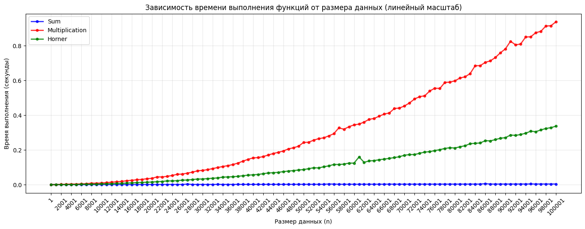
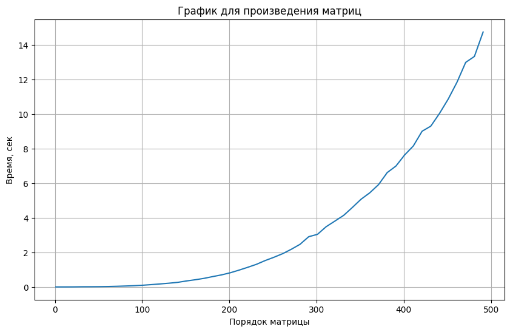

```python
import random
import matplotlib.pyplot as plt
from usage_time import get_usage_time

def sum_func(v):
    """Сумма элементов вектора"""
    s = 0
    for i in range(len(v)):
        s += v[i]
    return s

def mult_func(v):
    """Произведение элементов вектора"""
    m = 1
    for i in range(len(v)):
        m = m * v[i]
    return m

def horner_func(v, x=2):
    """Вычисление полинома методом Горнера"""
    p = 0
    for i in range(len(v)-1, -1, -1):
        p = p * x + v[i]
    return p

time_sum = get_usage_time(number=5, ndigits=6)(sum_func)
time_mult = get_usage_time(number=5, ndigits=6)(mult_func)
time_horner = get_usage_time(number=5, ndigits=6)(horner_func)

sizes = list(range(1, 101000, 1000))

sum_times = []
mult_times = []
horner_times = []

for n in sizes:
    vector = [random.randint(1, 100) for _ in range(n)]

    sum_time = time_sum(vector)
    mult_time = time_mult(vector)
    horner_time = time_horner(vector, 2)
    
    sum_times.append(sum_time)
    mult_times.append(mult_time)
    horner_times.append(horner_time)

plt.figure(figsize=(14, 10))

plt.subplot(2, 1, 1)
plt.plot(sizes, sum_times, 'bo-', label='Sum', linewidth=2, markersize=4, alpha=0.8)
plt.plot(sizes, mult_times, 'ro-', label='Multiplication', linewidth=2, markersize=4, alpha=0.8)
plt.plot(sizes, horner_times, 'go-', label='Horner', linewidth=2, markersize=4, alpha=0.8)

plt.title('Зависимость времени выполнения функций от размера данных (линейный масштаб)')
plt.xlabel('Размер данных (n)')
plt.ylabel('Время выполнения (секунды)')
plt.grid(True, alpha=0.3)
plt.legend()
plt.xticks(sizes[::2], rotation=45)


plt.tight_layout()
plt.show()
```


    

    
    


```python
import functools
import timeit
from usage_time import get_usage_time
import typing

import random

N = 6

def matrix_generator(n):
    matrix = []
    for i in range(n):
        line = [random.randint(1, 100*N) for j in range(n)]
        matrix.append(line)
    return matrix

def matrix_proizv(n):
    a = matrix_generator(n)
    b = matrix_generator(n)
    c = [[] for i in range(n)]
    for i in range(n):
        for j in range(n):
            element = 0
            for k in range(n): 
                element += a[i][k] * b[k][j]
            c[i].append(element)
    return c

import matplotlib.pyplot as plt

N = 10

def five_iteration_matrix(n):
    time_of_matrix = []
    matrix_time = get_usage_time(ndigits=5)(matrix_proizv)
    for i in range(5):
        time_of_matrix.append(matrix_time(n))
    average_time_matrix = sum(time_of_matrix)/5
    return average_time_matrix

items = list(range(1, (10**2*N)//2+1, 10))
times_matrix = []
for i in items:
    times_matrix.append(five_iteration_matrix(i))

plt.figure(figsize=(10, 6))
plt.plot(items, times_matrix)
plt.title('График для произведения матриц')
plt.xlabel('Порядок матрицы')
plt.ylabel('Время, сек')
plt.grid(True)
```


    

    


```python

```
